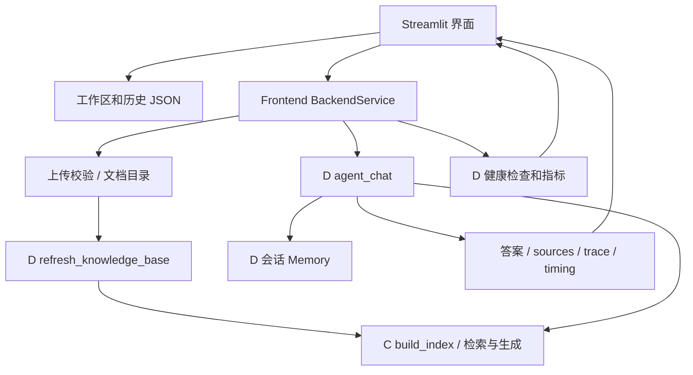

# 成员 A：模块四前端技术实现与交接

日期：2026-10-08。职责来源：课程 5.4.3、5.4.4 与提供的 A/B/C/D 分工文本。成员 A 占 15%，负责界面、展示、会话和前端接入；检索算法、ReAct/Memory 算法与系统部署仍由 C/D 负责。

## 1. 读取现有项目后的判断

- C 已提供 PDF 加载、三种分块、向量检索、BM25、RRF、Reranker、RAG Pipeline 及对外接口。仓库中有分块粒度实验 CSV，但没有 Hit@5/MRR 对比结果；原自检报告是服务器上的历史记录，不能作为本机已验证证据。
- D 已提供统一 `agent_chat()`、规则路由、7 个工具、ReAct 重试和降级、会话 Memory、来源隔离、双论文对比、可观测日志与健康检查。交付文件声称已完成的事项不等同于本机运行验证。
- 原项目没有前端，运行路径绑定 `/root/autodl-tmp/`。当前下载副本没有 `.git`，没有连接远程分支；本次没有提交或推送共享 GitHub 仓库。
- 课设与实现仍有差距：Word/TXT 加载、增量索引、真正的模型流式事件、Token 指标、工具耗时、检索评测指标均未在当前 C/D 接口中完整提供。课设列出 8 个工具，目前注册数为 7。并行工具执行也不能只凭文档认定已经完成。

## 2. 新增文件

| 文件 | 职责 |
| --- | --- |
| `app.py` | Streamlit 页面，文档/历史侧栏、中央聊天、引用与执行过程、状态监控 |
| `src/frontend/service.py` | C/D 接入边界，安全文件操作、建库状态、索引失效与恢复、会话记忆接入 |
| `src/frontend/state.py` | 工作区/会话持久化、UUID 隔离、原子写入、Markdown 导出 |
| `src/config.py` | 随项目位置变化的路径和可配置的模型/服务地址 |
| `requirements-frontend.txt` | 仅界面依赖 |
| `requirements-runtime.txt` | Mac/CPU 可用的后端直接依赖清单 |
| `.streamlit/config.toml` | 配色、上传大小和 Streamlit 启动配置 |
| `tests/` | 状态/接入测试和安装 Streamlit 后运行的 UI 测试 |
| `scripts/capture_frontend.py` | 对真实运行界面截图 |

## 3. 数据流与接口

界面问答只通过适配层调用统一 `agent_chat()`，不实现新的 Router 或检索算法。文档变化后使用 D 的 `refresh_knowledge_base()` 更新索引；删文档走可恢复的移动操作，并使旧索引失效。知识库为空时允许当前时间工具，论文问答给出上传提示。

后端现有 RAG 实例是进程内共享状态，索引重建与问答不能并发修改。适配层用一个 `RLock` 串行化；两个浏览器工作区有不同会话 UUID、不同历史文件，但使用同一个知识库。当前采用单进程课程演示方式，不承诺多 worker 之间一致性或高并发吞吐。

## 4. 为本机集成做的兼容修复

对 C/D 的修改保持公开函数参数和返回结构兼容：

1. `src/generation/__init__.py` 将重型模型导入延迟到第一次建库，默认文档目录读共享配置；`RAGPipeline` 导出保持兼容。健康检查和时间工具不再因为 import 而要求先安装 Torch。
2. `src/generation/rag_pipeline.py` 补上 `load_pdf` 导入，修复指定文件/文件列表建库的 NameError，问答模型读取配置。
3. `vector_store.py`、`reranker.py` 读取可配置模型路径与设备；默认向量库跟随项目目录。
4. `health.py` 使用同一文档和向量库路径，避免 Mac 上误报论文数为 0。
5. `llm_client.py` 读取 Ollama 地址/模型；`observability.py` 日志目录使用项目绝对路径，避免从不同目录启动时日志分散。

旧实验脚本的服务器示例路径仍保留；新的前端启动流程使用共享配置。C 原始交接文档保留为历史说明，以本次新增配置和使用说明为本机集成依据。

## 5. 交给 B 的材料

- 使用说明：`docs/frontend_guide.md`，可整合入最终用户手册。
- 本文可作为课程报告“模块四前端实现”内容。
- 验证范围与未完成项：`docs/member_A_validation.md`。
- 截图生成命令：`python scripts/capture_frontend.py --with-rag`。必须在真实环境生成并复核，不能把尚未生成的图列为已交付截图。
- 不提供虚构的检索命中率或 Token 数据；B 应使用系统真实运行日志和自己的评测集。

## 6. 需要 C/D 联调的字段

| 当前缺口 | 前端行为 | 推荐后端扩展 |
| --- | --- | --- |
| 无实时回答流 | 完整答案返回后逐字展示 | 保持 `agent_chat` 兼容，新增事件/流式入口 |
| 无实时 trace | 完成后按步骤展示实际轨迹 | 事件回调或迭代器提供阶段和工具完成通知 |
| 无可靠 Token 指标 | 显示未提供 | 统一 `token_usage`，区分各 LLM/工具请求 |
| 工具耗时多数未返回 | 有字段才显示 | trace 中提供耗时与执行结果 |
| 检索命中率没有评测集 | 显示待评测 | B 提供与评测集对应的统计结果 |
| Word/TXT/Markdown 不支持 | 只开放 PDF 上传 | C 提供统一格式加载接口 |
| 内存检索器不持久化 | 重启后首次论文请求恢复/重建 | C/D 提供持久化索引恢复接口 |

以上缺口不通过扩展 A 的职责去重写 C/D 算法，也不应在最终报告中写成已实现。
